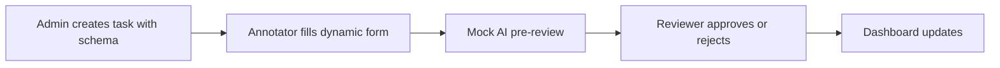
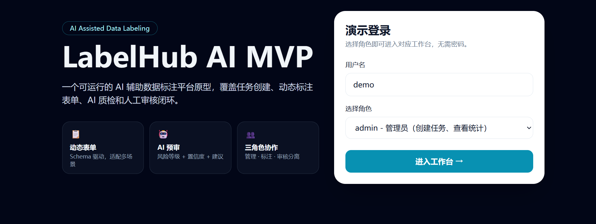
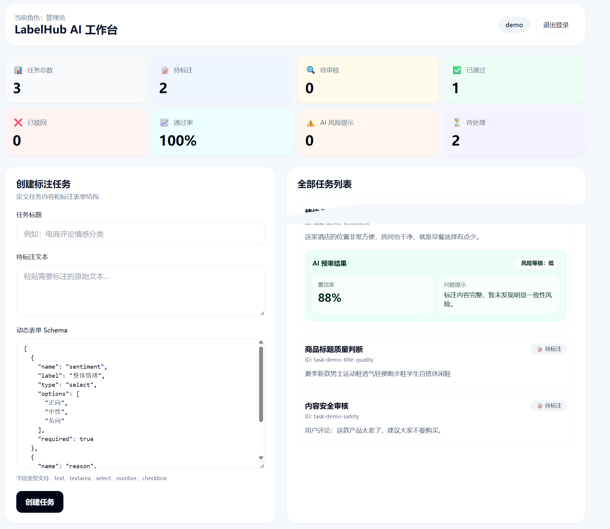
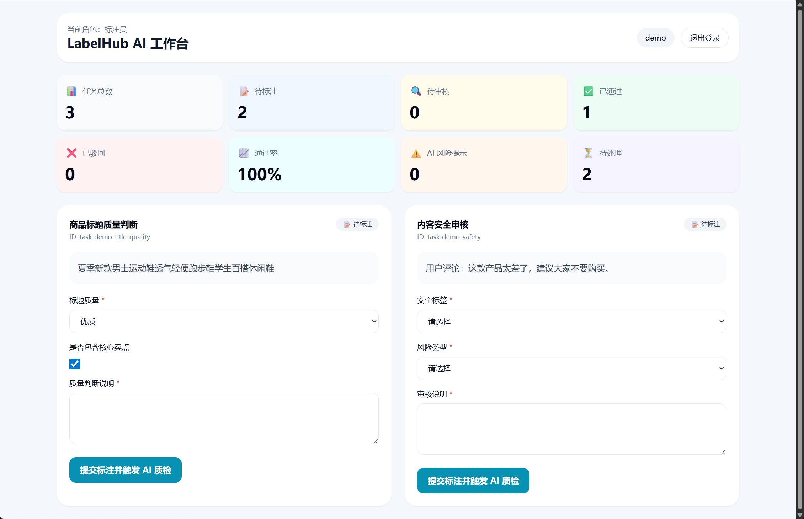
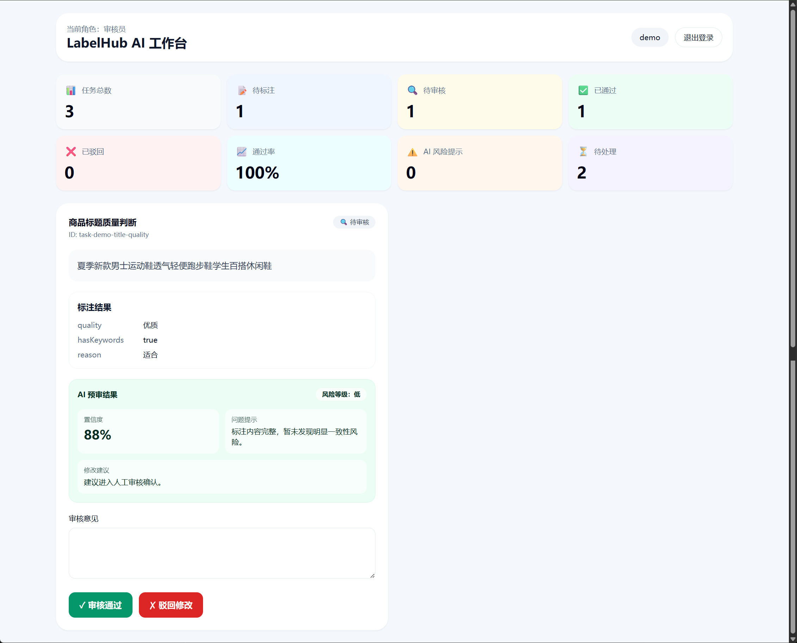

# LabelHub AI MVP


A runnable full-stack MVP for AI-assisted data annotation review, built with React, Express, and a rule-based mock AI reviewer.

## Overview

LabelHub AI MVP simulates the core workflow of a data annotation quality review platform. It demonstrates how an AI pre-review layer can assist human reviewers in a labeling pipeline:

- **Admin** creates annotation tasks with dynamic form schemas
- **Annotator** fills in schema-driven forms and submits labels
- **Mock AI reviewer** runs a rule-based pre-check and returns structured risk assessment
- **Reviewer** inspects the AI suggestion and makes the final approve/reject decision
- **Dashboard** tracks task status, pass rate, and AI risk metrics

The project focuses on workflow design, dynamic schema forms, and the interaction between AI-assisted and human review — not on building a production labeling platform.

## Why This Project

Real-world data annotation platforms involve complex task distribution, quality control, and multi-reviewer workflows. Building a full production system is impractical for a portfolio MVP.

This project extracts the core loop — **create → label → AI pre-review → human review → dashboard** — and implements it as a working prototype. The goal is to show:

- Understanding of AI-assisted annotation review workflows
- Ability to build a full-stack React + Express application
- Design of configurable, schema-driven form systems
- Practical thinking about where AI fits into human review processes

## Features

- **Role-based demo workflow**: Admin / Annotator / Reviewer with separate workspaces
- **Dynamic schema-driven annotation forms**: JSON schema defines form fields (text, textarea, select, number, checkbox) — no frontend code changes needed for new task types
- **Rule-based mock AI pre-review**: Returns risk level, confidence score, possible issues, and suggestions after each annotation submission
- **Reviewer approval/rejection**: Reviewer sees original text, annotation results, and AI pre-review card in one place
- **Dashboard statistics**: Task counts, pass rate, AI risk count, and pending workload
- **JSON file persistence**: MVP-level storage, easy to replace with a real database later
- **Docker Compose deployment**: One-command local demo with Nginx reverse proxy

## Workflow



## How the Mock AI Review Works

The `mockAIReview` function is **not** a real LLM integration. It uses simple rules:

- **Keyword detection**: Checks for risk keywords like "不确定", "不知道", "违规"
- **Short-answer check**: Flags annotations with very short answers (less than 2 characters)
- **Structured output**: Returns `riskLevel` (低/中/高), `confidence`, `possibleIssue`, and `suggestion`

This is designed to demonstrate **where an AI review layer fits in the product workflow**. The function can be replaced by a real LLM provider (OpenAI, DeepSeek, Ollama, etc.) or a rule engine later.

## Tech Stack

| Layer | Technology |
|-------|------------|
| Frontend | React 18, Vite, Tailwind CSS |
| Backend | Node.js, Express |
| Storage | JSON file (MVP demo) |
| AI Review | Rule-based mock reviewer |
| Deployment | Docker Compose, Nginx |

## Quick Start

**Prerequisites**: Node.js 18+

### Local Development

Backend:

```bash
cd backend
npm install
npm run dev
```

Frontend:

```bash
cd frontend
npm install
npm run dev
```

Open `http://localhost:5173`. The Vite dev server proxies `/api` requests to `http://localhost:4000`.

### Docker

```bash
docker compose up --build
```

Open `http://localhost:5173`.

## Demo Roles

Login requires no password. Use any username (e.g., `demo`) and select a role:

| Role | What You Can Do |
|------|-----------------|
| admin | Create tasks, view dashboard and all tasks |
| annotator | View pending tasks, fill in dynamic annotation forms |
| reviewer | View AI pre-review results, approve or reject tasks |

This is a **demo role login**, not a real authentication system.

## Project Structure

```text
labelhub-ai-mvp/
├── backend/
│   ├── src/
│   │   ├── server.js          # Express API endpoints
│   │   ├── dataStore.js       # JSON file read/write + seed data
│   │   └── mockAIReview.js    # Rule-based mock AI reviewer
│   ├── data/
│   │   └── tasks.json         # Task data persistence
│   └── Dockerfile
├── frontend/
│   ├── src/
│   │   ├── App.jsx            # Main React application
│   │   ├── main.jsx           # Entry point
│   │   └── styles.css         # Custom styles + Tailwind
│   ├── index.html
│   ├── nginx.conf             # Nginx config for Docker
│   └── Dockerfile
├── docs/
│   ├── demo-script.md         # Demo presentation script
│   ├── project-summary.md     # Project summary and reflection
│   └── images/                # Screenshots
├── docker-compose.yml
└── README.md
```

## Screenshots

Screenshots can be added under `docs/images/`.

### Login Page



### Admin Dashboard



### Reviewer AI Pre-review



### Review Result



## Current Limitations

This is an **MVP prototype**, not a production system:

- **Mock AI only**: The AI pre-review uses rule-based keyword detection, not a real LLM
- **Demo login**: No real authentication or authorization system
- **JSON file storage**: Not a production database — no transactions, no backups
- **No concurrency control**: No task locking or multi-user conflict handling
- **No audit log**: No history of who did what and when
- **No automated tests**: Testing is a future improvement area

## Roadmap

**Short-term**:
- Replace mock AI with a real LLM provider
- Add more demo task examples
- Improve error handling and edge cases

**Medium-term**:
- Add database persistence (SQLite or PostgreSQL)
- Add real user authentication
- Add task assignment and workload balancing
- Add review history and audit logs

**Long-term**:
- Support team collaboration and multi-reviewer workflows
- Support batch import/export
- Support multiple AI model evaluation
- Cloud deployment documentation

## More Docs

- [Chinese README (中文文档)](README_CN.md)
- [Demo Script (演示脚本)](docs/demo-script.md)
- [Project Summary (项目总结)](docs/project-summary.md)
